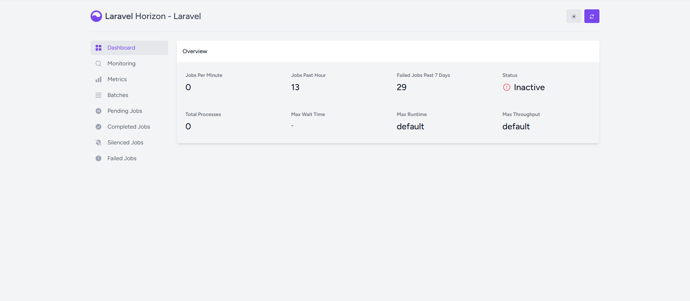
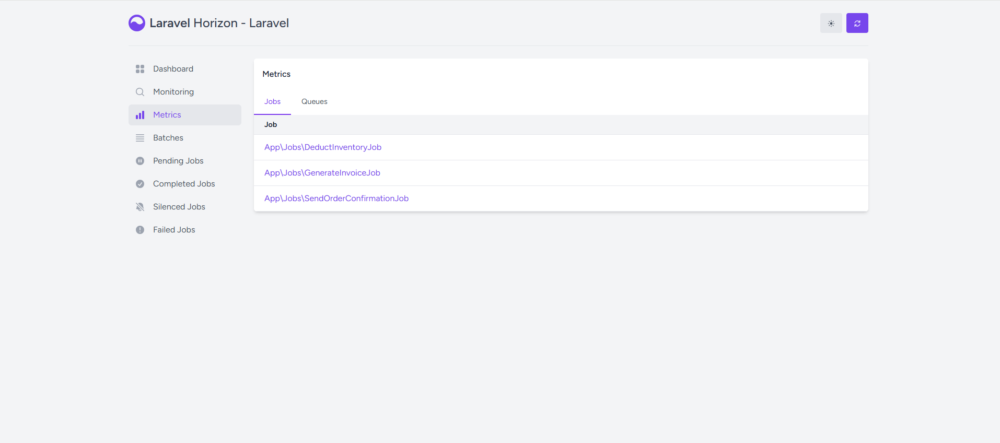
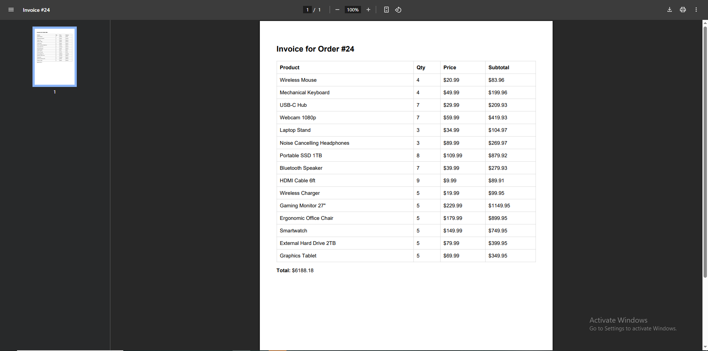
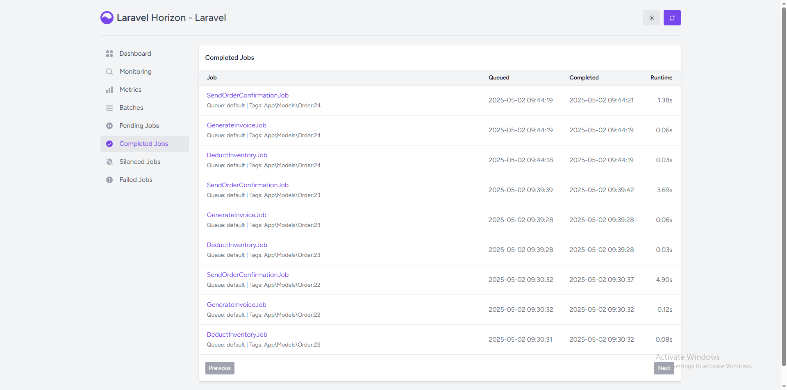
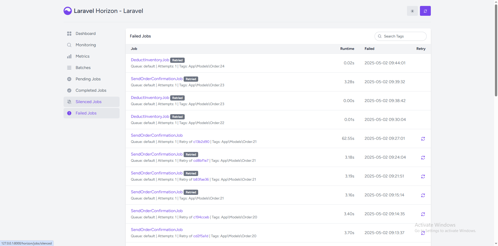
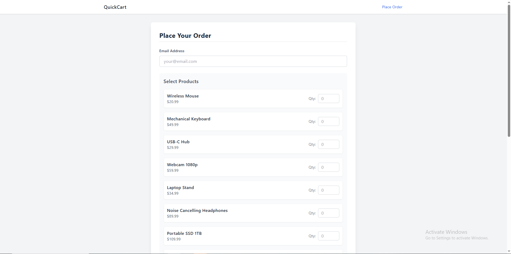
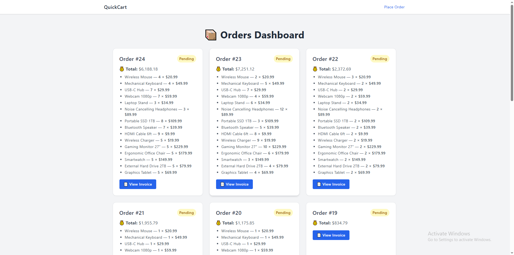
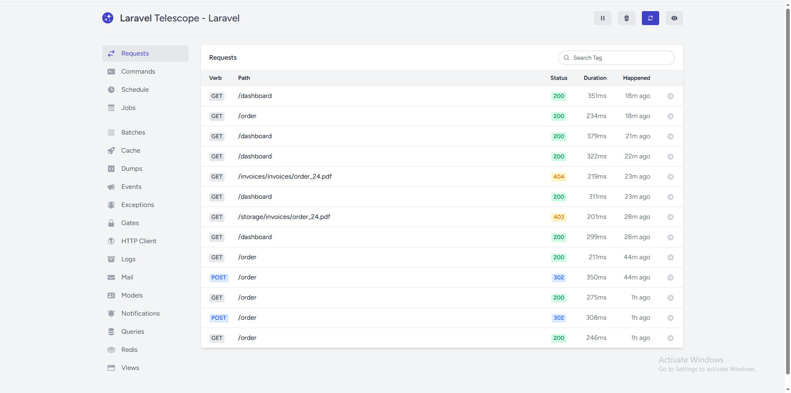
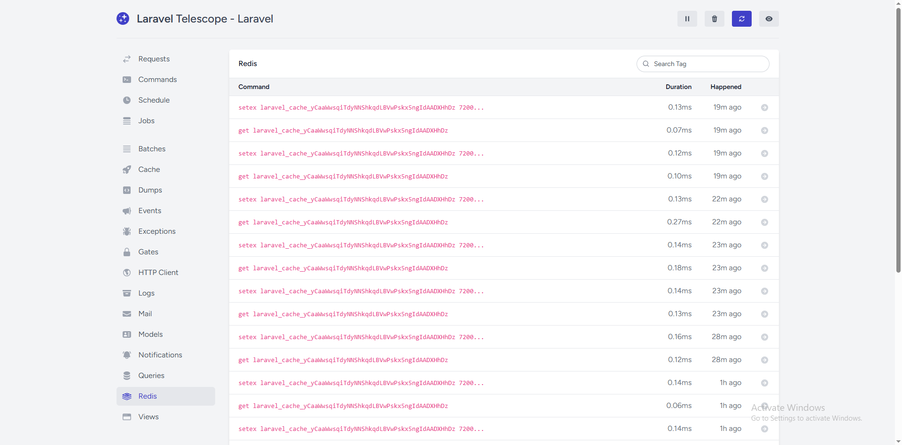
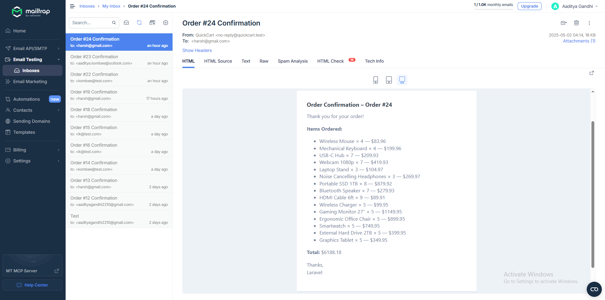

# 🛒 **QuickCart Order Processor** 🚀

Welcome to the **QuickCart Order Processor** project! This demo showcases **Laravel Horizon**'s capabilities in managing queue job chains and background processing. The system simulates a simple order processing workflow, which includes:

- Deducting inventory 🏷️
- Generating invoices 💸
- Sending confirmation emails 📧

After an order is placed, these tasks are automatically handled in the background using **Laravel Queues** and **Horizon**.

## 🌟 Features

- **Queue Job Chaining:** Process orders in multiple steps with chained jobs 🔗.
- **Inventory Deduction:** Deduct inventory from the database after an order is placed 🛒.
- **Invoice Generation:** Automatically generate a PDF invoice for each completed order 📑.
- **Email Confirmation:** Send order confirmation emails to customers 📧.
- **Job Monitoring with Horizon:** Monitor real-time job progress and retry failed jobs with **Laravel Horizon** 🕹️.
- **Dashboard:** View orders and invoices in a simple, user-friendly dashboard 📊.

## 🛠️ Tech Stack

- **Backend:** Laravel 12.x 💻
- **Queue Management:** Laravel Horizon 🔄
- **Job Chaining:** Laravel Queues ⏳
- **PDF Generation:** `barryvdh/laravel-dompdf` 📄
- **Emailing:** Laravel's built-in Mail functionality 📧
- **Database:** MySQL (or compatible DB) 🗄️
- **Frontend:** Tailwind CSS for UI styling 🌈


## 🖼️ Screenshots

### 📌 



### 📌 



### 📌




### 📌 




### 📌 



### 📌 



### 📌 



### 📌



### 📌



### 📌




---


## 📥 Installation

Follow these steps to set up the project locally:

### 🔧 Prerequisites

- PHP 8.1 or higher 🐘
- Composer 📦
- Laravel 12.x 🌍
- MySQL (or another compatible database) 💾
- Redis (for Horizon) 🔥

### 🧑‍💻 Clone the Repository

```bash
git clone https://github.com/your-username/quickcart-order-processor.git
cd quickcart-order-processor
```
### 📦 Install Dependencies

```bash
composer install
```

### ⚙️ Set Up Environment File

```bash
cp .env.example .env
```

### 🗄️ Set Up Database

```bash
DB_CONNECTION=mysql
DB_HOST=127.0.0.1
DB_PORT=3306
DB_DATABASE=quickcart_db
DB_USERNAME=root
DB_PASSWORD=
```

### 🧑‍💻 Migrate
```bash
php artisan migrate
```

### 🚀 Set Up Horizon
```bash
php artisan horizon:install
php artisan horizon
```

### 📧 Set Up Mail Configuration
```bash
MAIL_MAILER=smtp
MAIL_HOST=sandbox.smtp.mailtrap.io
MAIL_PORT=2525
MAIL_USERNAME=--------
MAIL_PASSWORD=********
MAIL_ENCRYPTION=tls
MAIL_FROM_ADDRESS=no-reply@quickcart.test
MAIL_FROM_NAME="QuickCart"
```

### 🖨️ Generate the Invoices
```bash
composer require barryvdh/laravel-dompdf
```

### 💻 Run the Application
```bash
php artisan serve
```

## 📂 Folder Structure Highlights

```plaintext
├── app/
│   ├── Http/
│   │   └── Controllers/
│   │       ├── Controller.php
│   │       └── OrderController.php
│   ├── Jobs/
│   │   ├── DeductInventoryJob.php
│   │   ├── GenerateInvoiceJob.php
│   │   └── SendOrderConfirmationJob.php
│   ├── Mail/
│   │   └── OrderConfirmationMail.php
│   ├── Models/
│   │   ├── Invoice.php
│   │   ├── Order.php
│   │   ├── OrderItem.php
│   │   ├── Product.php
│   │   └── User.php
│   └── Providers/
│       ├── AppServiceProvider.php
│       ├── HorizonServiceProvider.php
│       ├── HorizonWindowsServiceProvider.php  # Or standard Auth/Event/Route SPs
│       └── TelescopeServiceProvider.php
├── bootstrap/
│   └── [...] # Standard bootstrap files/cache
├── config/
│   ├── app.php
│   ├── auth.php
│   ├── cache.php
│   ├── database.php
│   ├── dompdf.php
│   ├── filesystems.php
│   ├── horizon.php
│   ├── logging.php
│   ├── mail.php
│   ├── queue.php
│   ├── services.php
│   ├── session.php
│   └── telescope.php
│   └── [...] # Other standard config files
├── database/
│   ├── factories/
│   │   └── UserFactory.php
│   ├── migrations/
│   │   └── [...] # Migration files
│   └── seeders/
│       ├── DatabaseSeeder.php
│       └── ProductSeeder.php
├── public/
│   ├── images/
│   │   └── [...] # Image assets
│   ├── invoices/
│   │   ├── order_20.pdf
│   │   ├── order_21.pdf
│   │   ├── order_22.pdf
│   │   ├── order_23.pdf
│   │   └── order_24.pdf
│   ├── vendor/
│   │   └── [...] # Published vendor assets (like Horizon UI)
│   ├── .htaccess
│   ├── favicon.ico
│   ├── index.php
│   └── robots.txt
├── resources/
│   ├── css/
│   │   └── [...] # CSS files (e.g., app.css)
│   ├── js/
│   │   └── [...] # JavaScript files (e.g., app.js)
│   └── views/
│       ├── dashboard/
│       │   └── index.blade.php
│       ├── emails/
│       │   └── order/
│       │       └── confirmation.blade.php
│       ├── invoices/
│       │   └── pdf/            # Note: Structure shown in image
│       │       └── invoice.blade.php
│       ├── layouts/
│       │   └── app.blade.php
│       ├── order/
│       │   └── create.blade.php
│       └── welcome.blade.php
├── routes/
│   ├── console.php
│   └── web.php
├── storage/
│   └── [...] # Standard storage folders (app, framework, logs)
├── tests/
│   └── [...] # Standard test folders (Feature, Unit)
├── vendor/
│   └── [...] # Composer dependencies
├── .editorconfig
├── .env
├── .env.example
├── .gitattributes
├── .gitignore
├── artisan
├── composer.json
├── composer.lock
├── database.sqlite  # As shown in image (often in database/)
├── package.json
├── phpunit.xml
├── README.md
└── vite.config.js
```


## 📝 Usage

### 🚶‍♂️ Order Processing Flow

- Place an Order: A user places an order via the front-end interface.

- Queue Jobs: The system queues the following jobs:

- Deduct inventory based on the products ordered.

- Generate an invoice for the order.

- Send a confirmation email to the customer.

- Monitor Jobs: Laravel Horizon is used to monitor the jobs, ensuring they are processed in the correct order.

- Retry Failed Jobs: If a job fails, you can retry it manually from the Horizon dashboard.


## 📊 Monitoring with Horizon

#### Access the Horizon dashboard by navigating to /horizon in your application URL: http://localhost:8000/horizon
### Use the Horizon dashboard to:
- Monitor the status of queues (pending, processing, completed jobs).
- View job throughput and processing times.
- Inspect details of recently completed or failed jobs.
- Manually retry failed jobs.
- Manage and monitor queue workers.


## 🔭 Debugging with Telescope

#### Access the Telescope dashboard by navigating to /telescope: http://localhost:8000/telescope
### Telescope provides deeper insights into your application's execution, which is invaluable during development and debugging:
- Requests: See incoming HTTP requests and their details.
- Jobs: View detailed information about dispatched and processed queue jobs, including payloads and any exceptions. This complements Horizon by showing more detail about individual job executions.
- Exceptions: Log and inspect any errors that occur anywhere in the application, including within jobs.
- Logs: View application log entries.
- Queries: Inspect database queries executed during requests or jobs (e.g., see the exact SQL used for inventory deduction).
- Mail: See details of emails sent by the application, including recipients and content previews (great for debugging the SendConfirmationEmail job).
- Models: Track Eloquent model events (create, update, delete).


## 🤝 **Contributing**

We welcome contributions! Follow these steps to contribute:

1. Fork the repository.
2. Create a new branch for your feature/fix.
3. Commit changes and open a **Pull Request**.

---

## 📜 **License**

This project is licensed under the [MIT License](LICENSE).

---

## 👨‍💻 **Author**

**Kombee Technologies**

- 🌐 [Portfolio](https://github.com/kombee-technologies)
- 💼 [LinkedIn](https://in.linkedin.com/company/kombee-global)
- 🌍 [Website](https://www.kombee.com/)

---

<p align="center">
  Built with ❤️ using Laravel
</p>

---
